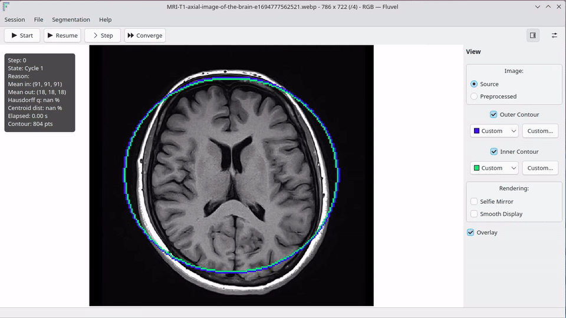

<p align="center">
  
</p>

<h1 align="center" style="color:#6b6fcf;">
  Fluvel
</h1>

<p align="center">
  <strong>
    Real-time image segmentation and active contour experimentation platform
  </strong>
</p>

<p align="center">
  Modern C++ framework for active contour algorithms,
  real-time visualization and reproducible experimentation.
</p>

<p align="center">

  

  

  

</p>

---

# Demo

## Real-time tracking

<p align="center">
  
</p>

<p align="center">
  <a href="assets/videos/phone_tracking.webm">
    Open full video
  </a>
</p>

## MRI contour evolution

<p align="center">
  
</p>

<p align="center">
  <a href="assets/videos/mri_segmentation.webm">
    Open full video
  </a>
</p>

## 🚀 Downloads

Latest builds and packages for all supported platforms:

[Download page](https://fbessy.github.io/fluvel/)

---

## 📚 Documentation

The online documentation is generated automatically from the source code
and follows the latest development version.

Documentation is versioned and tied to specific commits
for reproducibility and long-term experimentation.

[Documentation site](https://fabienip.gitlab.io/fluvel/)

---

## ✨ Features

- Region-based active contour evolution
- Real-time image processing
- Video stream support
- Modular architecture for feature extensions
- Qt-based visualization interface
- Reproducible builds (CMake, Flatpak, AppImage)

---

## 🧠 Overview

Fluvel is a research-oriented image segmentation platform
focused on region-based active contour methods.

The project emphasizes:

- Modern C++ architecture
- Real-time experimentation
- Separation between processing engine and UI
- Reusable image processing components
- Reproducible scientific workflows

The processing core does not depend on Qt.
Qt is used only for visualization and interaction.

---

## 🏗️ Architecture

The project is organized into:

```text
fluvel/
├── src/                           # Source code
│   ├── app/                       # Desktop/mobile Qt application
│   │   ├── ui/                    # Windows and reusable UI components
│   │   ├── qml/                   # Experimental UI layer
│   │   ├── core/                  # Application logic and orchestration
│   │   └── interop/               # Application integration and adapters
│   │
│   ├── bindings/                  # Language and scripting integrations
│   │   └── python/                # Python bindings (pybind11)
│   │
│   └── image_processing/          # Image processing library
│       ├── filtering/             # Filtering, denoising and preprocessing
│       ├── segmentation/          # Active contours and segmentation models
│       ├── analysis/              # Shape analysis and image metrics
│       └── core/                  # Shared processing infrastructure
│
├── examples/                      # Python examples demonstrating Fluvel IP features
│   ├── filtering/                 # Image filtering examples and experiments
│   ├── hausdorff/                 # Shape comparison and Hausdorff distance examples
│   ├── segmentation/              # Active contour segmentation examples
│   ├── workflow/                  # Complete processing pipeline examples
│   ├── resources/                 # Shared datasets and images used by examples
│   └── utils.py                   # Shared utilities used across examples
│
├── resources/                     # Icons and application assets
├── translations/                  # Application translations (.ts, .qm)
│
├── scripts/                       # Development, packaging and utility scripts
│                                  # Includes local testing and maintenance helpers
│
├── docs/                          # Generated local documentation (optional)
├── web/                           # Website and homepage
│
├── cmake/                         # Shared CMake modules and configuration
├── packaging/                     # Flatpak, AppImage and distribution files
│
├── .github/                       # CI workflows, releases and automation
├── .gitlab-ci.yml                 # Online documentation pipeline
│
└── CMakeLists.txt                 # Main build configuration
```

### Main modules

- **fluvel** — Qt-based user interface and application orchestration
- **fluvel_ip** — Image processing and segmentation library (C++)
- **fluvel_bindings** — Python bindings for Fluvel IP (pybind11/C++)

---

Fluvel follows a hybrid architecture:

- **Technical organization** for application layers (UI, integration and execution flow)
- **Functional organization** for image processing modules (filtering, segmentation and analysis)

Build, release and deployment automation are intentionally kept outside the source tree and are handled through repository workflows and helper scripts.

Some components (such as additional UI technologies and language integrations) are experimental and may evolve over time.
```

## 🛠️ Build

### Requirements

#### Core library

- CMake ≥ 3.x
- C++23 compiler (tested with Clang, GCC and MSVC)

#### Desktop application

Additional dependency:

- Qt6

#### Python bindings

Additional dependencies:

- Python ≥ 3.10
- pybind11
- NumPy

Optional (examples only):

- OpenCV

---

### Build desktop application

```bash
cmake -S . -B build \
    -DFLUVEL_BUILD_APP=ON \
    -DFLUVEL_BUILD_BIND=OFF

cmake --build build
./build/Fluvel
```

---

### Build Python bindings

```bash
cmake -S . -B build \
    -DFLUVEL_BUILD_APP=OFF \
    -DFLUVEL_BUILD_BIND=ON

cmake --build build
```

Generated module:

```text
build/python/fluvel.*
```

Install runtime dependencies for examples:

```bash
pip install numpy opencv-python
```

Example:

```bash
python examples/filtering/showcase.py
```

---

### Build everything

```bash
cmake -S . -B build \
    -DFLUVEL_BUILD_APP=ON \
    -DFLUVEL_BUILD_BIND=ON

cmake --build build
```

---

## 📜 License

Fluvel is licensed under the CeCILL 2.1 license
(CEA · CNRS · INRIA).

CeCILL is a French free software license compatible with the GNU GPL,
widely used in research and academic software.

[CeCILL 2.1 License](https://cecill.info/licences/Licence_CeCILL_V2.1-en.html)
