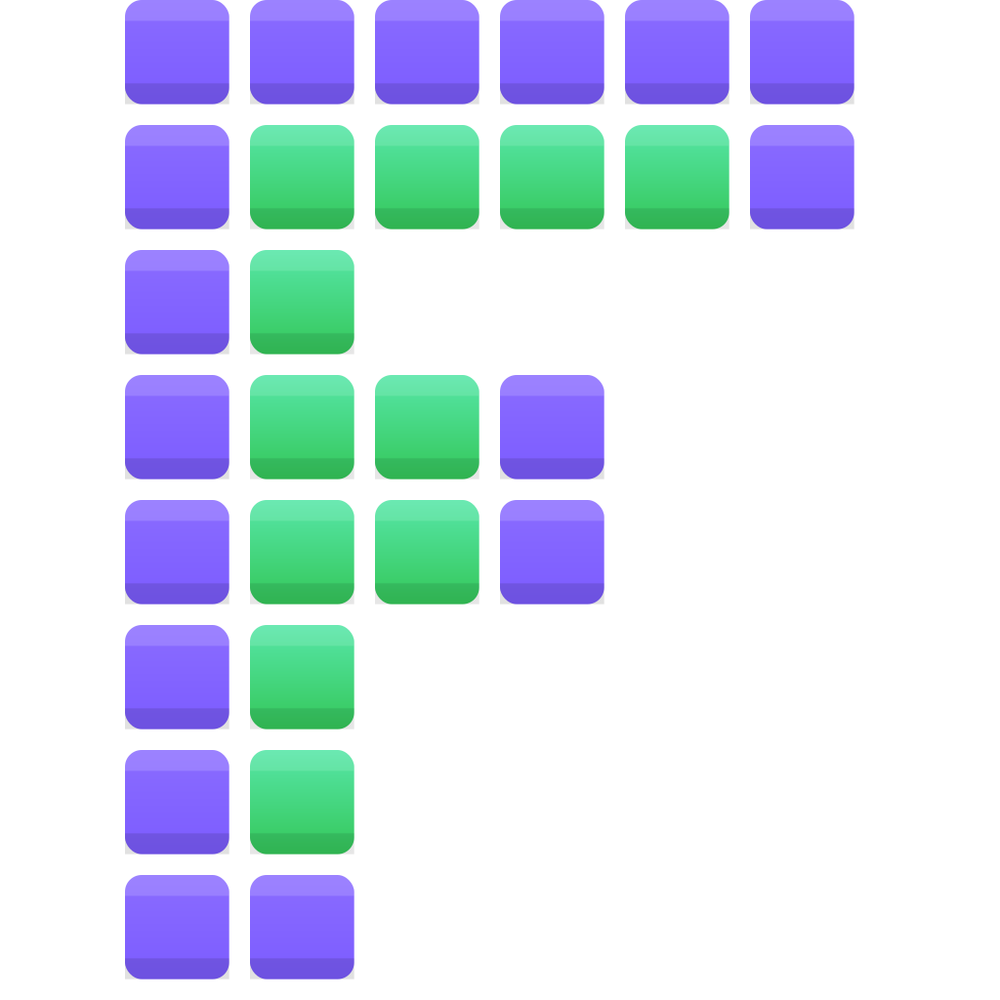

<p align="center">
  
</p>

<h1 align="center" style="color:#6b6fcf;">
  Fluvel
</h1>

<p align="center">
  <strong>
    Real-time image segmentation and active contour experimentation platform
  </strong>
</p>

<p align="center">
  Modern C++ framework for active contour algorithms,
  real-time visualization and reproducible experimentation.
</p>

<p align="center">

  

  

  

</p>

---

# Demo

## Real-time tracking

<video src="assets/videos/phone_tracking.webm"
       controls
       muted
       width="900">
</video>

[Open video directly](assets/videos/phone_tracking.webm)

## MRI contour evolution

<video src="assets/videos/mri_segmentation.webm"
       controls
       muted
       width="900">
</video>

[Open video directly](assets/videos/mri_segmentation.webm)

## 🚀 Downloads

Latest builds and packages for all supported platforms:

[Download page](https://fbessy.github.io/fluvel/)

---

## 📚 Documentation

The online documentation is generated automatically from the source code
and follows the latest development version.

Documentation is versioned and tied to specific commits
for reproducibility and long-term experimentation.

[Documentation site](https://fabienip.gitlab.io/fluvel/)

---

## ✨ Features

- Region-based active contour evolution
- Real-time image processing
- Video stream support
- Modular architecture for feature extensions
- Qt-based visualization interface
- Reproducible builds (CMake, Flatpak, AppImage)

---

## 🧠 Overview

Fluvel is a research-oriented image segmentation platform
focused on region-based active contour methods.

The project emphasizes:

- Modern C++ architecture
- Real-time experimentation
- Separation between processing engine and UI
- Reusable image processing components
- Reproducible scientific workflows

The processing core does not depend on Qt.
Qt is used only for visualization and interaction.

---

## 🏗️ Architecture

The project is organized into:

- `src/` — Core engine and application code
- `docs/` — Documentation configuration
- `packaging/` — Flatpak, AppImage and distribution files
- `CMakeLists.txt` — Build configuration

Main modules:

- **fluvel_app** — UI and orchestration
- **fluvel_ip** — Image processing engine

---

## 🛠️ Build

### Requirements

- CMake ≥ 3.x
- Clang (recommended)
- Qt6 (for UI build)

### Build with CMake

```bash
cmake -S . -B build
cmake --build build
./build/Fluvel
```

---

## 📜 License

Fluvel is licensed under the CeCILL 2.1 license
(CEA · CNRS · INRIA).

CeCILL is a French free software license compatible with the GNU GPL,
widely used in research and academic software.

[CeCILL 2.1 License](https://cecill.info/licences/Licence_CeCILL_V2.1-en.html)
