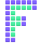

<p align="center">
  
</p>

Active contour (level-set) image processing engine written in modern C++.

Fluvel is a region-based active contour engine focused on clarity, performance,
and clean architecture. The core processing logic is independent from the UI,
allowing reuse as a standalone library and facilitating testing
and integration in different environments.

The project is currently under active development.

---

### Overview

Fluvel implements region-based active contour algorithms operating on
row-major image buffers. The goal is to provide:

- A clear and maintainable implementation of active contour models
- A modern C++ architecture
- Separation between processing engine and visualization layer
- Reproducible builds and clean packaging (CMake + Flatpak)

The processing core does not depend on Qt.
Qt is used only for visualization and interaction.

---

### Features

- Region-based active contour evolution
- Row-major raw buffer image processing
- Configurable color space handling
- Modular architecture for feature extensions
- Qt-based visualization interface
- Flatpak packaging support

---

### Architecture

The project is organized into:

- `src/` — Core engine and application code
- `docs/` — Documentation configuration (Doxygen)
- `CMakeLists.txt` — Build configuration
- `fluvel.json` — Flatpak manifest

The image processing engine operates on contiguous memory buffers.
Visualization and UI components are separated from the core algorithmic logic.

---

### Modules

- **fluvel_app** — Application layer (UI and orchestration)
- **fluvel_ip** — Image processing engine (algorithms and data processing)

---

### Build

#### Requirements

- CMake ≥ 3.x
- Clang (recommended)
- Qt6 (for UI build)

#### Build with CMake

```bash
cmake -S . -B build
cmake --build build
./build/fluvel   # ou le nom de ton binaire
